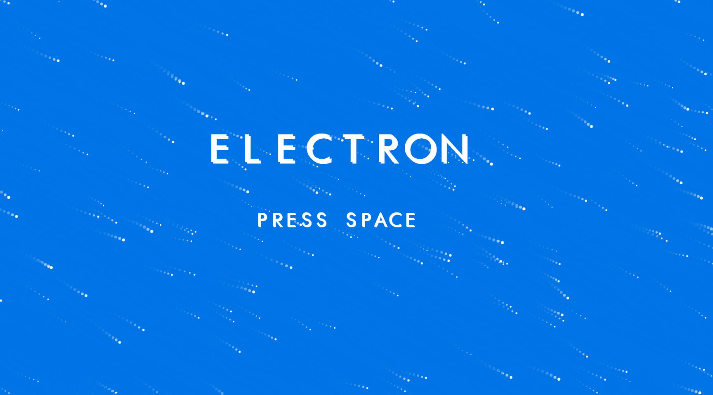
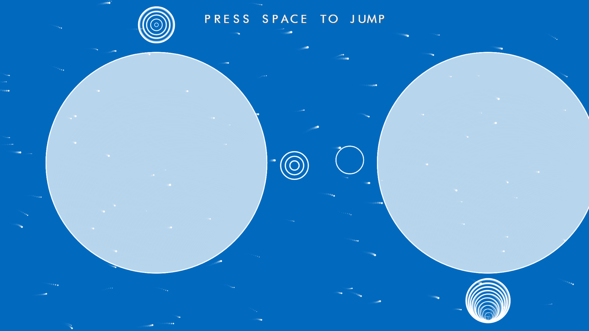
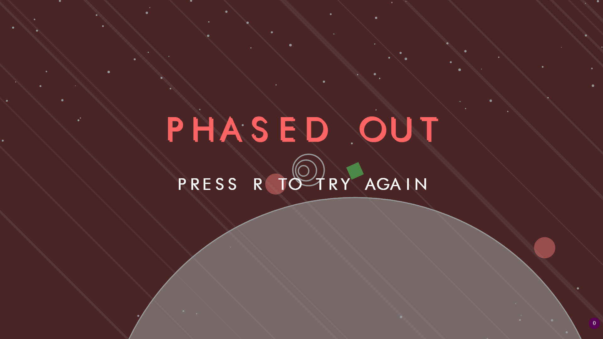

# Electron - Game Design Project

The game was designed to be a riff on common platforming games utilising the same freedom in terms of lateral exploration, avoidance of enemies, collecting items throughout the levels and ultimately attempting to arrive at the of the level without dying. The key difference with electron is in the mode in which traversal is achieved, where moving left means moving anti-clockwise and moving right means moving clockwise around large circles called "cores". Much in the same way jumping is mirrored in this game except means migrating from the orbit of one core to the orbit of the adjacent core. The player must be within the jump angle of the two cores and within the "Lagrange" position between the cores.

The games developmental progress is documented in this trello, which shows all major changes and additions to the game.

 - https://trello.com/b/WD3wn6JT/g54gam-electron

The underlying game engine being used :

 - https://github.com/paperschool/Multi-Agent-Game

### Screen Shots

- - -

- - -

- - -

- - -

- - -

- - -

- - -
